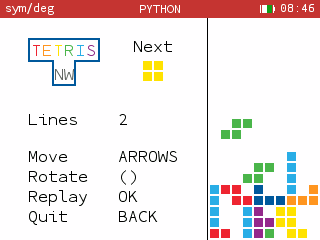
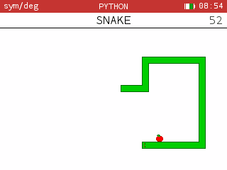
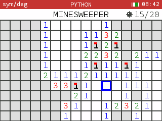
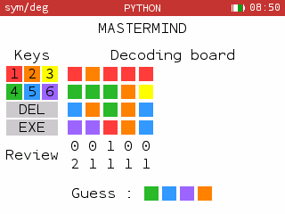
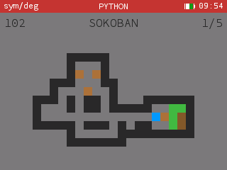

## General instructions

Here are some classic games in Python designed for the Numworks calculator. Follow the links to install the games.

Enter BACK twice to escape any game.

Some settings are easy to change : do not hesitate to make the game your own !

## Links

- [Tetris](https://my.numworks.com/python/arthurjacquin/tetris)
- [Snake](https://my.numworks.com/python/arthurjacquin/snake)
- [Minesweeper](https://my.numworks.com/python/arthurjacquin/minesweeper)
- [Mastermind](https://my.numworks.com/python/arthurjacquin/mastermind)
- [Sokoban](https://my.numworks.com/python/arthurjacquin/sokoban)

## Tetris

Commands :
- Navigate : arrows
- Rotate : parantheses
- Replay : `OK`

## Snake

Commands :
- Navigate : arrows
- Replay : `OK`

You may want to try the *mad* mode, set teleporting borders or change the snake speed.

## Minesweeper

Commands :
- Navigate : arrows
- Clear mine : `OK`
- (Un)Flag : `DEL`
- Replay : `OK`

You may want to change the number of mines.

## Mastermind

Commands :
- Choose color : numbers
- Suppress color : `DEL`
- Make a guess : `EXE`
- Replay : `OK`

## Sokoban

Commands :
- Navigate : arrows
- Undo : `DEL`
- Change level : `+` and `-`
- Help : `ANS`
- Replay : `OK`

This game is less usual. You are a pusher employee in a store room. You have to push the boxes to their goal while minimizing moves. You can not push two boxes at once or pull them.

You may want to change the levels. Some are waiting for you in `sokoban_levels.py`. If this is not enough, you can download levels and convert them for the `sokoban.py` :

1. Download levels from [this site](http://www.sourcecode.se/sokoban/levels).
2. Put `sokoban_extract.py` and the levels in the same directory.
3. Execute `sokoban_extract.py`. You will be prompted for the name of the level file.
4. The extracted levels are in `<file_name>_extracted.py`. Just replace the levels in `sokoban.py` by the new ones.
